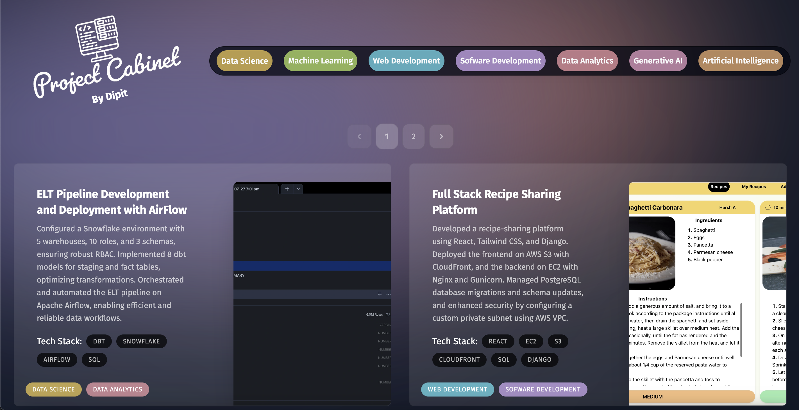

# Dipit's Project Cabinet

**Project Cabinet** is a sleek, interactive portfolio designed to showcase my coding projects through visually engaging cards. It features a responsive design, advanced filtering, and sorting capabilities, providing a dynamic and organized presentation of my work.

## Features

- **Project Cards**: Each card displays a project's title, description, tech stack, and relevant tags, with smooth hover effects.
- **Filtering & Sorting**: Easily filter projects by category and view the most recent work.
- **Responsive Design**: Adapts seamlessly to various screen sizes for a consistent user experience.
- **Thematic Adaptability**: Supports both light and dark modes for visual appeal.

## Technologies Used

- **React**
- **Next.js**
- **Tailwind CSS**
- **Framer Motion**
- **JavaScript**

## Visit

Check out the live demo of **Project Cabinet** [here]('https://project-cabinet.vercel.app/').

---

Thank you for checking out **Project Cabinet**! If you have any feedback or questions, don't hesitate to reach out.
